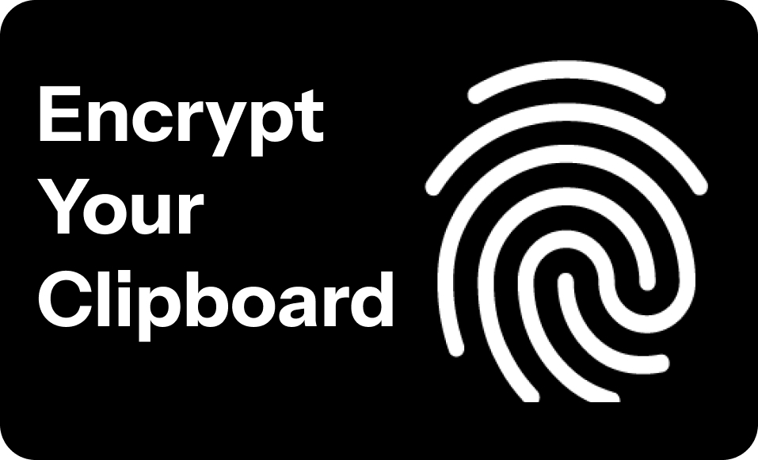

# SecureClipboard

This is a project to create a secure version of the clipboard with history. It will include one time pastes, encryption, etc. This is an attempt to make pasting safe again after the rising amount of javascript websites that steal your clipboard.
